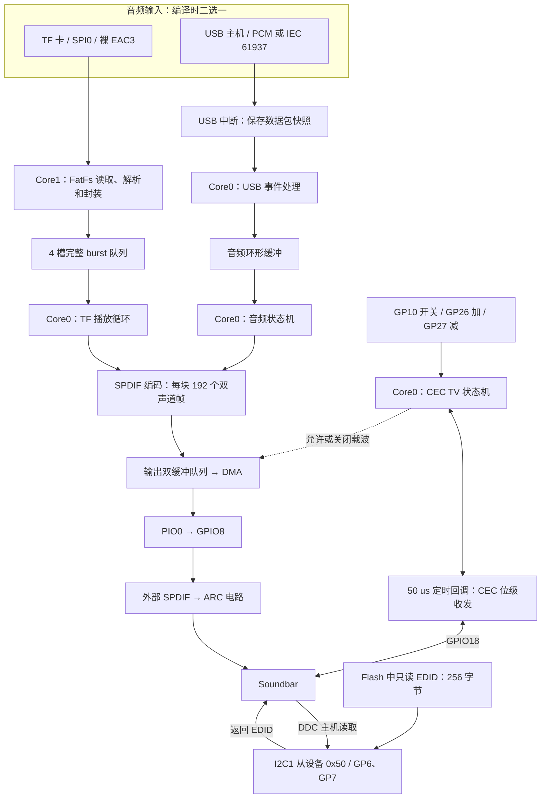
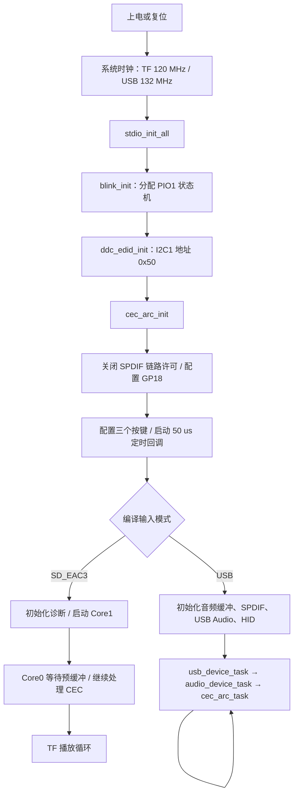
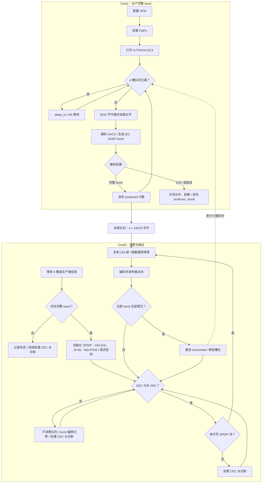
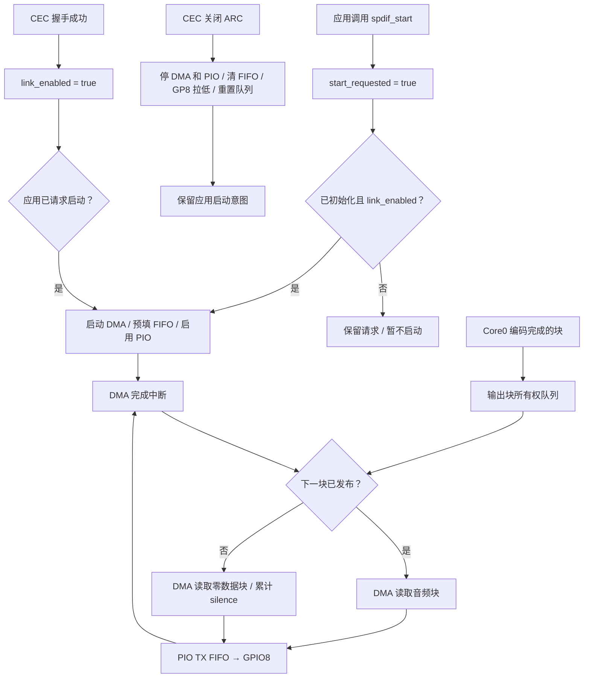
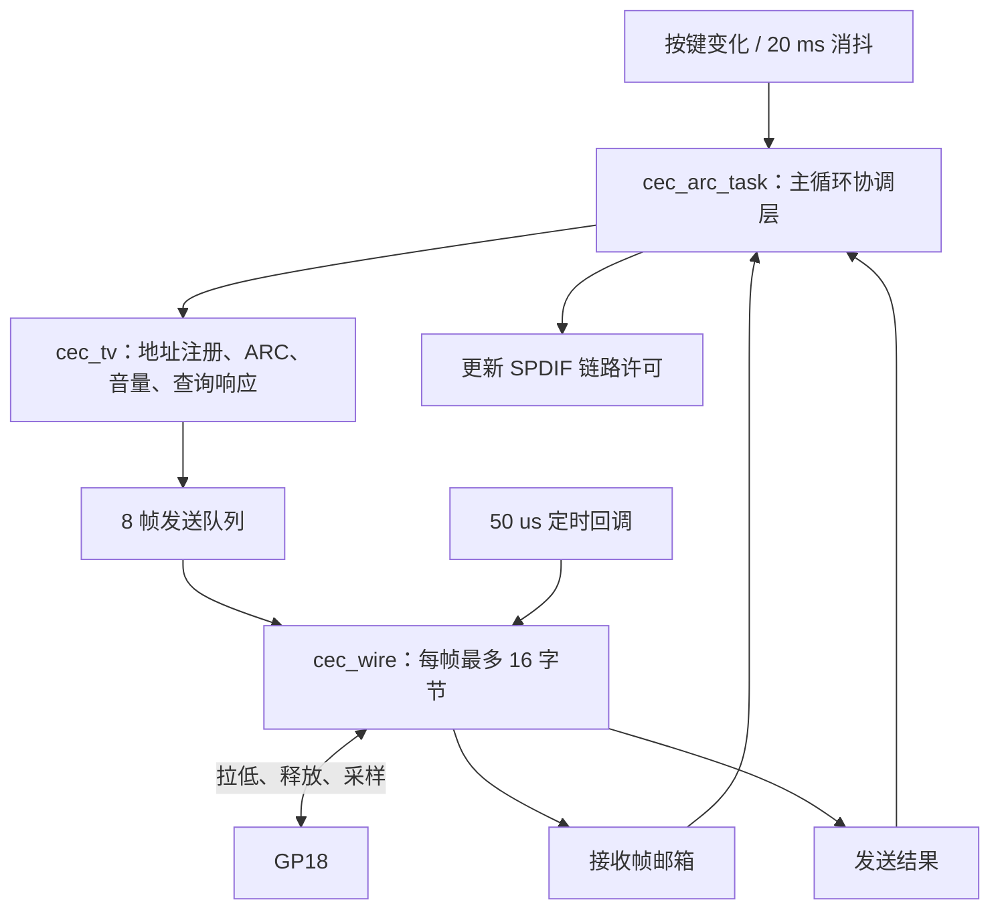
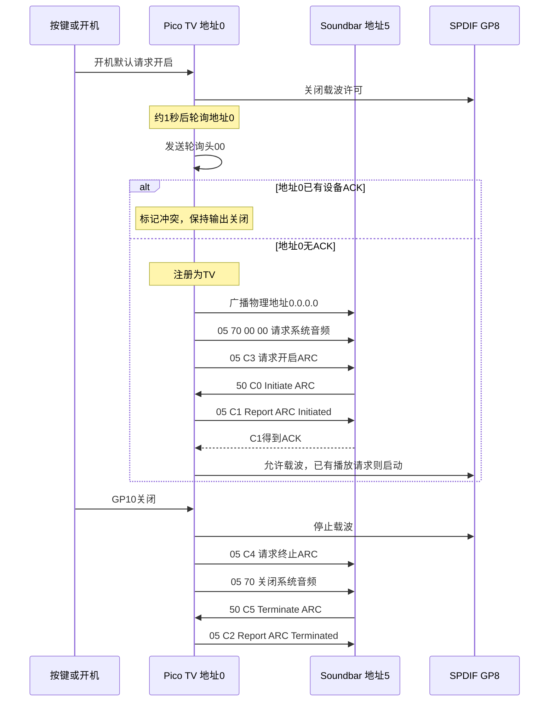
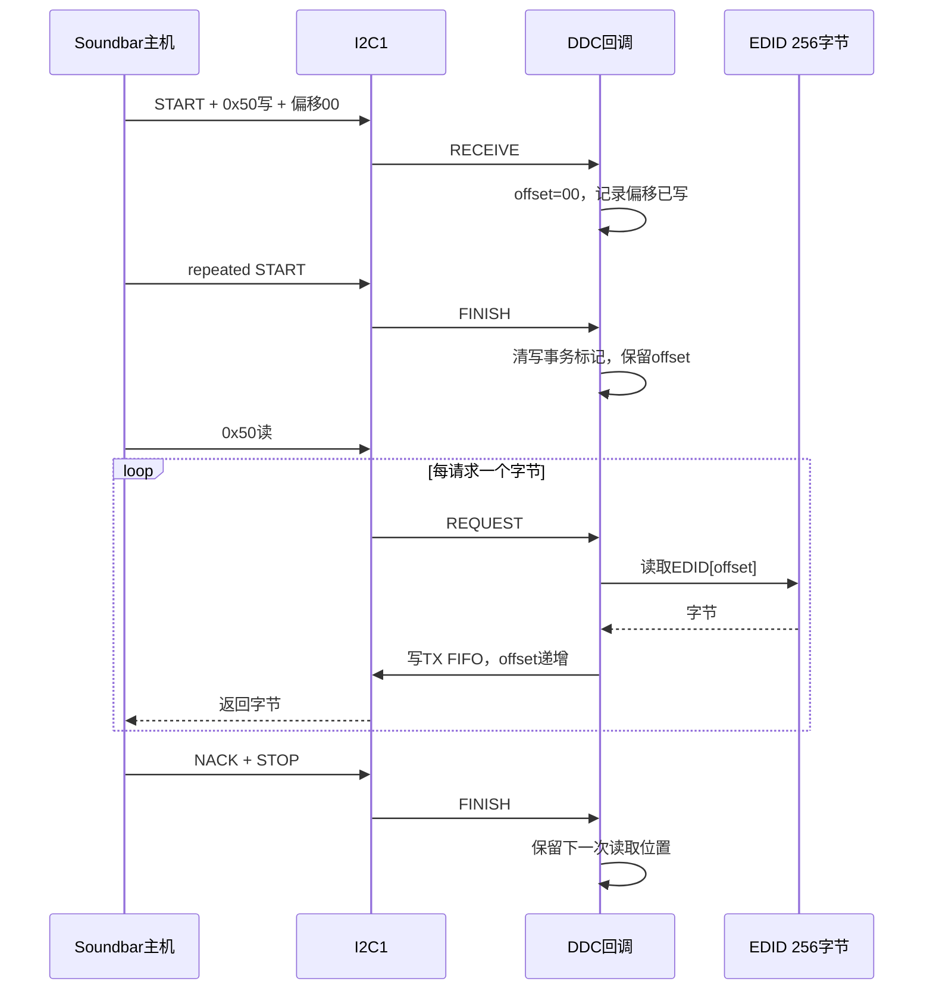
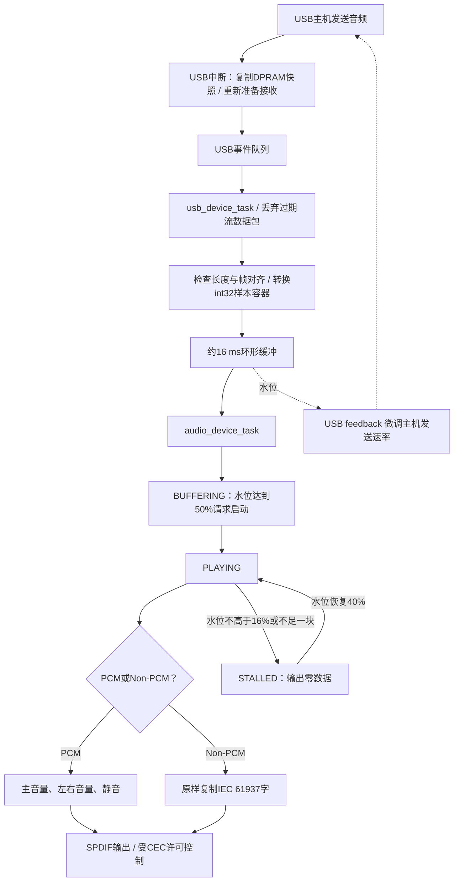

# 程序运行逻辑与外设配置

日期：2026-09-18。范围：`arc-tx-eac3` 分支当前 CEC、DDC、TF 与 USB 实现。
本文描述软件逻辑，不代表所有功能已通过 Soundbar 实机验证。
流程图采用 Mermaid；查看时需要支持 Mermaid 的 Markdown 预览器。

## 1. 总体结构

程序分为三条相对独立的链路：

- 音频：TF 或 USB → 音频缓冲 → SPDIF → 外部 ARC 电路。
- 控制：CEC → ARC 开关、Soundbar 音量。
- 信息：DDC → Soundbar 读取内置 EDID。

**DDC 被读取不会直接开启音频；CEC 握手成功也不意味着已有音频数据。**

没有 FreeRTOS：采用主循环、中断与 PIO/DMA；只有 TF 模式启动 Core1。
TF 与 USB 是不同构建，不是运行时自动切换。

## 2. 外设配置

下表编号均为 GPIO 编号，而非 Pico 物理引脚编号。

| 模块 | 当前配置 | 执行位置或用途 |
| --- | --- | --- |
| 系统时钟 | TF 120 MHz；USB 132 MHz | `main()` 启动时设置 |
| TF SPI | SPI0；SCLK=GP2、MOSI=GP3、MISO=GP4、CS=GP5 | Core1 读卡 |
| TF SPI 速率 | 初始化配置 100 kHz；正常传输配置 12 MHz | TF 驱动使用 |
| DDC | I2C1 从设备；SDA=GP6、SCL=GP7；7 位地址 0x50 | I2C 中断处理 |
| DDC 时钟 | 初始化参数 100 kHz；总线实际时钟由主机提供 | 支持硬件时钟拉伸 |
| DDC 上拉 | 内部上拉关闭 | 外部上拉、电平转换 |
| SPDIF | PIO0，GPIO8，动态申请状态机 | 外部 ARC 转换电路输入 |
| SPDIF DMA | 动态申请通道；32 位传输；PIO TX DREQ | 源地址递增，目标固定为 TX FIFO |
| DMA 中断 | DMA_IRQ_1，最高中断优先级 | 完成一块后接续下一块 |
| CEC | GP18，开漏式输出，无内部上拉 | 拉低或切为输入释放总线 |
| CEC 定时 | 每 50 μs 回调 | 收发时序、采样、ACK |
| ARC 开关键 | GP10，输入上拉，低有效 | 20 ms 消抖 |
| 音量加 / 减 | GP26 / GP27，输入上拉，低有效 | 长按约每 300 ms 重复 |
| 板载 LED | PIO1；标准 Pico 为 GP25 | USB 音频状态指示 |
| USB 控制 LED | GP9、GP12；GP11、GP14 配为低电平输出 | HID 控制 |
| 原第三路 LED | GP26/GP28 不作为 LED 初始化 | 避免音量加按键冲突 |
| UART | 当前 TF 版关闭日志输出 | 保留 SD 诊断计时、计数 |
| I2S | 两个 ARC 构建均禁用 | GP18 已供 CEC 使用 |

PIO 状态机及 DMA 通道编号由运行时申请，不保证为 SM0 或 DMA0。
标准 Pico 上 GP6/7/8/18/26 分别对应物理脚 9/10/11/24/31。

## 3. 上电初始化

入口：[main.c](main.c)。

DDC 早于音频输入初始化，即使 TF 挂载失败仍可读取 EDID。
CEC 初始化关闭输出许可，避免未完成 ARC 握手就输出载波。

## 4. TF 双核播放流程

实现：[sd_eac3_player.c](sd_eac3_player.c)。只有 Core1 访问 FatFs。

| 缓冲层级 | 大小 | 对应时间 |
| --- | --- | --- |
| 文件读缓存 | 8192 字节 | 取决于 EAC3 码率 |
| 一个 IEC 61937 burst | 24576 字节 | 32 ms |
| 四槽 burst 队列 | 98304 字节，即 96 KiB | 最多约 128 ms |
| 一个 SPDIF 输出块 | 192 个双声道帧 | 192 kHz 下为 1 ms |
| 一个 burst | 32 个 SPDIF 输出块 | 32 ms |

Core1 只发布封装完成的数据；Core0 提交完一个 burst 的最后一部分才释放槽位。
这避免两个核心同时改写同一槽位。

### EAC3 封装

实现：[eac3_burst.c](eac3_burst.c)。

当前接受 48 kHz 裸 EAC3、独立子流 ID 0 及其关联帧。
这里只封装 IEC 61937，不进行 Dolby 解码；EAC3 的 Pd 使用 payload 字节数。

## 5. SPDIF、DMA 与链路许可

实现：[spdif.c](spdif.c)、[spdif_encode.c](spdif_encode.c)。

实际载波启动必须同时满足：SPDIF 已初始化、应用请求播放、TV 注册成功、无地址冲突、
ARC 状态 ON、用户仍要求开启。

编码后每块为 `768 × uint32_t`，即 3072 字节；DMA 只搬运编码数据，不解析 EAC3。
ARC 关闭会停止物理载波；ARC 开启但缺数据时继续输出零数据载波，压缩模式保留 Non-PCM 状态。

## 6. CEC 分层、时序与握手

实现：[cec_arc.c](cec_arc.c)、[cec_tv.c](cec_tv.c)、[cec_wire.c](cec_wire.c)。

定时回调只负责位级收发，不运行整套 ARC 业务，也不打印日志。

| 项目 | 当前代码值 |
| --- | --- |
| 定时采样 | 50 μs |
| 起始位低电平 / 总周期 | 3700 / 4500 μs |
| 数据 1 / 0 低电平 | 600 / 1500 μs |
| 数据位总周期 | 2400 μs |
| ACK / 竞争采样点 | 位开始后 1050 μs |
| 发送前空闲等待 | 16800 μs |
| 发送等待超时 | 2 秒 |
| 发送调度严重迟到 | 超过期限 200 μs，释放总线并失败 |
| 普通帧发送尝试 | 最多 3 次 |

等待开启、报告完成等阶段超时为 4 秒；仍有开启意愿时，之后等待 5 秒重试。
Soundbar 主动 C5 同样关闭输出。明确拒绝、Standby 或系统音频关闭后，不强行持续开启。
GP26/27 发送音量按下消息 `44 41/42`，松开发送 `45`，不修改压缩音频。
没有 HPD 拔线检测，拔线不保证自动改变 ARC 状态。

## 7. DDC EDID 读取

实现：[ddc_edid.c](ddc_edid.c)、[ddc_edid_data.c](ddc_edid_data.c)。

- 0x00～0x7F 是基本块，0x80～0xFF 是扩展块，读完回绕至 0x00。
- 写事务首字节设置偏移，后续字节丢弃，EDID 不可修改。
- 不响应 0x30 段指针。
- 不依赖 TF，不等待 CEC；没有“读完 EDID 才启动 CEC”的联动条件。
- 数据原样来自用户提供的 `ep-edid-retek-2000.bin`。

## 8. USB 音频模式

实现：[usb.c](usb.c)、[usb_audio.c](usb_audio.c)、[audio_device.c](audio_device.c)。

TF 模式由 Pico 封装裸 EAC3；USB 压缩模式要求主机已完成 IEC 61937 封装。
TF 在 ARC 关闭时暂停消费；USB 不会自动暂停电脑播放器，仍可能接收数据并溢出丢帧，
恢复时接收器需重新同步后续 burst。

## 9. 异常与边界行为

| 情况 | 当前行为 |
| --- | --- |
| TF 挂载或打开失败 | 不启动音频，继续 CEC 与 DDC |
| 文件结束 | 排空数据；ARC 开启时继续 Non-PCM 零数据载波 |
| TF 暂时供数不足 | 补零并累计 underrun |
| ARC 中途关闭 | 停 DMA/PIO，暂停消费 TF 队列 |
| ARC 重新开启 | TF 从当前完整 burst 头部重新提交 |
| CEC 地址0占用 | 标记冲突，不开启 ARC |
| CEC 发送失败 | 有限重试，结果交给 TV 状态机 |
| DDC 数据写入 | 丢弃，保持只读 |
| GP26 按下 | 向 Soundbar 发音量加，不驱动原 LED |
| Soundbar 不读 EDID | 不直接阻止 CEC 状态机运行 |

## 10. 调试观察点与硬件边界

可通过调试器观察以下变量：

- CEC：`cec_rx_frames`、`cec_tx_frames`、`cec_tx_errors`、`cec_rx_errors`、`cec_address_conflict`。
- ARC：`cec_arc_state`，0=关闭、1=等待C0、2=等待C1成功、3=开启、4=正在关闭。
- DDC：`ddc_read_bytes`、`ddc_offset_writes`、`ddc_ignored_writes`。
- TF：`sd_eac3_status`、`sd_eac3_bursts_played`、`sd_eac3_underruns`。
- SPDIF：`spdif_tx_stall_count`、`spdif_silence_block_count`。

HPD、HDMI +5V、DDC 双向电平转换及 SPDIF→ARC 电气转换由外部硬件负责。
GPIO 不可直接接入 5V 上拉总线。本程序不是完整 HDMI TV 或 eARC 实现。

相关接线、构建与限制详见 [CEC_ARC.md](CEC_ARC.md)、[SD_EAC3.md](SD_EAC3.md)、[SPDIF.md](SPDIF.md)。
