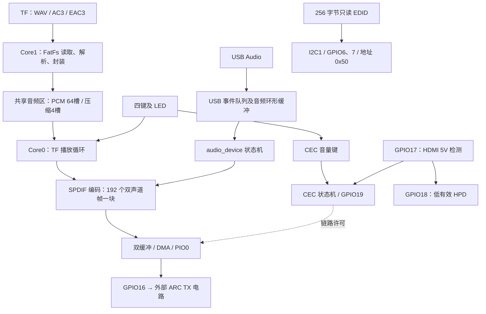
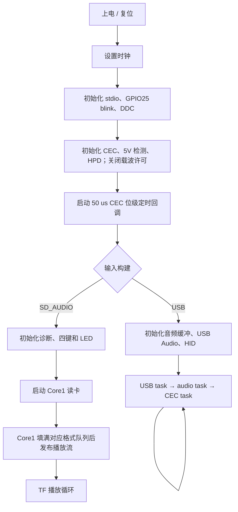
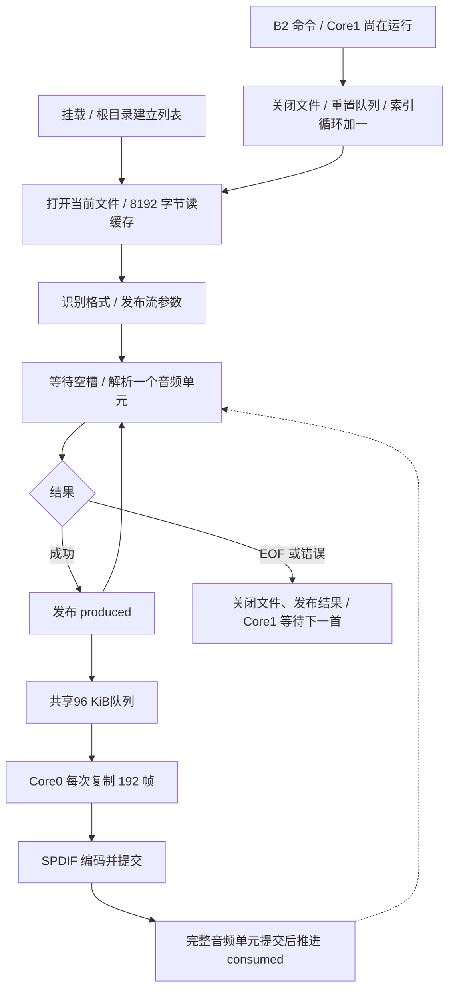
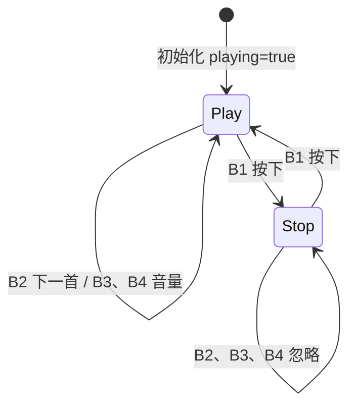
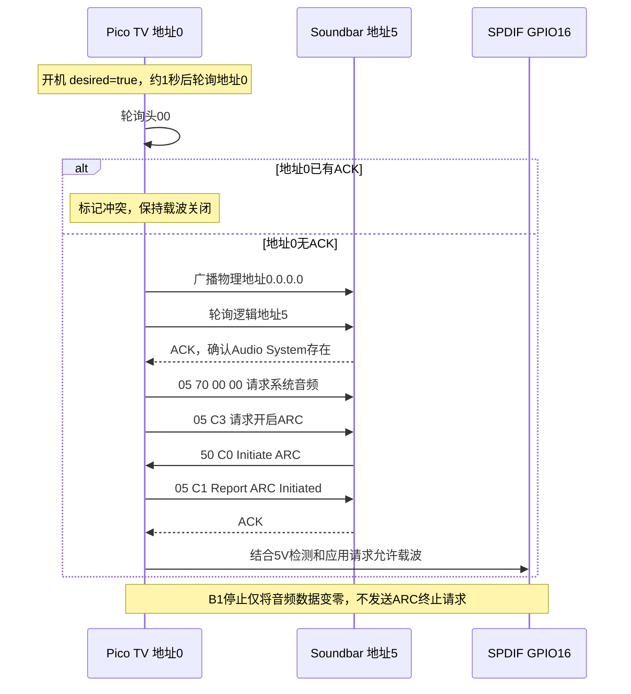

# 程序运行逻辑与外设配置

更新日期：2026-09-20。范围：`dev-zero-c1` 分支、RP-ZERO-C1 / RP2040 当前工作区代码。
本文描述实际实现；需求与实现尚不一致的部分见第 9 节。流程图需要支持 Mermaid 的 Markdown 预览器。

## 1. 总体结构与构建模式

TF 或 USB 音频经 SPDIF 编码、DMA 和 PIO，从 GPIO16 输出，再由外部电路转换为 ARC TX。
CEC 负责 ARC 握手与 Soundbar 音量控制，DDC 提供只读 EDID。
读取 EDID、建立 ARC 链路、存在可播放音频是三个不同条件。

没有 FreeRTOS，使用主循环、中断、PIO/DMA；只有 TF 模式启动 Core1。
TF 和 USB 在编译时二选一，不是运行时切换。

| 配置项 | 当前含义 |
| --- | --- |
| `PICODAC_INPUT=USB` | 默认 USB 声卡模式 |
| `PICODAC_INPUT=SD_AUDIO` | TF 文件播放，定义 `PICODAC_INPUT_SD=1` |
| `PICODAC_INPUT=SD_EAC3` | 兼容旧参数，配置时映射为 SD_AUDIO |
| `PICODAC_OUTPUT` | CMake 固定为 SPDIF |
| `PICODAC_SD_FILE` | 默认 `0:/TRACK.WAV`，目录扫描无候选时的后备路径 |
| `PICODAC_CEC` / `PICODAC_DDC` | CEC 默认开启，DDC 默认跟随 CEC 配置 |
| `PICODAC_SD_DIAGNOSTICS` | 默认关闭，可开启非阻塞 UART 诊断 |
| `PICODAC_SD_UART_LOG` | 默认开启，可关闭 TF stdio UART 日志 |
| `PICODAC_SD_BENCHMARK` | 默认关闭；开启后播放前只读测试每个 WAV 最多 4 MiB，并通过 UART 输出吞吐量与慢读延迟 |

I2S 历史源码仍在仓库，但目标不编译 I2S/BOTH，固定
`PICODAC_OUTPUT_SPDIF=1`、`PICODAC_OUTPUT_BOTH=0`。

## 2. RP-ZERO-C1 引脚与外设

编号均为 GPIO 编号，不是物理脚编号。

| 功能 | GPIO / 配置 | 用途 |
| --- | --- | --- |
| UART0 TX / RX | 0 / 1 | 日志及可选诊断；诊断使用 115200 8N1 |
| TF SPI0 SCK / MOSI / MISO / CS | 2 / 3 / 4 / 5 | Core1 访问 FatFs；初始化100 kHz，正常默认24 MHz |
| DDC SDA / SCL | 6 / 7，均属于 I2C1 | 地址 0x50，关闭内部上拉 |
| SPDIF / ARC TX | 16，PIO0 | 固定输出引脚，动态申请状态机 |
| HDMI 5V Detect | 17，输入 | 高电平表示检测到 HDMI 5V，经外部电路转换电平 |
| HDMI HPD | 18，低有效输出 | 初始化为高，任务中输出 `!hdmi_present` |
| HDMI CEC | 19，开漏式收发 | 拉低或切为输入释放，无内部上拉 |
| 状态 LED | 25，高有效，PIO1 | TF：ARC 未开启时亮 1 秒、灭 1 秒，开启时常亮；USB 保留音频状态显示 |
| B1 Key / LED+ / LED− | 10 / 9 / 11 | TF 播放/停止 |
| B2 Key / LED+ / LED− | 13 / 12 / 14 | TF 下一首 |
| B3 Key / LED+ / LED− | 21 / 20 / 22 | CEC 音量加 |
| B4 Key / LED+ / LED− | 27 / 26 / 28 | CEC 音量减 |

TF 系统时钟为 120 MHz，USB 为 132 MHz。SPDIF 按请求采样率取整配置 PIO 分频器；
TF 没有 USB feedback 校正环路，44.1 kHz 的实际频率受分频精度影响。
DMA 使用动态通道、32 位传输、PIO TX DREQ 和最高优先级的 DMA_IRQ_1。
状态机和 DMA 通道编号不固定。

## 3. 上电初始化

入口：[main.c](main.c)。

CEC 开机默认请求开启 ARC。TF `playing` 标志初始为 true，因此初始化后四个按键 LED 均亮，
预缓冲后自动请求启动 SPDIF；实际载波仍受 CEC 握手和 GPIO17 检测约束。
DDC 先于读卡初始化，TF 失败不阻止 EDID 读取。

## 4. TF 文件发现、格式与双核缓冲

实现：[sd_eac3_player.c](sd_eac3_player.c)。只有 Core1 访问 FatFs。

挂载后扫描 TF 根目录，跳过子目录，按扩展名不区分大小写收集
`.wav`、`.ac3`、`.ec3`、`.eac3`，最多 32 首。
保持 FAT 枚举顺序，不按名称排序、不递归；没有候选时使用 `PICODAC_SD_FILE`。
每个路径槽 64 字节，扫描最多复制 60 字节文件名，过长名称可能被截断。

扩展名仅决定列表入选；打开后按文件头识别 WAV、AC3，其余进入 EAC3 解析器检查。

| 类型 | 当前接受格式 | 输出单元 |
| --- | --- | --- |
| WAV | RIFF/WAVE、PCM tag=1、双声道；44.1/48/96/192 kHz，各支持 16/24-bit | 每槽 192 帧；有符号右对齐 int32 容器，原位深/请求采样率输出 PCM |
| AC3 | 当前路径接受 48 kHz 裸 AC3 | 3072 个 16-bit 字的 IEC 61937 burst，48 kHz Non-PCM |
| EAC3 | 48 kHz 裸 EAC3，独立子流 ID 0 及关联 dependent 帧 | 累计六个音频块；12288 个 16-bit 字，192 kHz Non-PCM |

WAV 跳过 JUNK、LIST 等未知块及奇数字节填充，要求 fmt 块先于 data。
支持传统 PCM tag=1，以及有效位数等于容器位数、子格式 GUID 为整数 PCM 的 WAVE_FORMAT_EXTENSIBLE。
24-bit 文件样本为紧凑三字节，解包保留有效位；末块不足 192 帧时补零。
不接受浮点、单声道、多声道、有效位数与容器位数不同的 Extensible PCM 或 RF64。
WAV 不重采样、不施加软件音量；AC3/EAC3 不解码、不重新编码。
AC3 的 Pc=0x01、Pd 为 payload 位数；EAC3 的 Pc=0x15、Pd 为 payload 字节数。

音频区使用 union 分配，总计固定96 KiB：压缩格式划分为4个大槽，PCM划分为64个192帧小槽，
不增加RAM占用。开始输出前先填满对应格式的队列，以覆盖TF卡的单次读取延迟。

| 格式 | 一槽时间 | 队列总时长 | 每槽 SPDIF 块数 |
| --- | --- | --- | --- |
| WAV 44.1 kHz | 约4.35 ms | 约278.6 ms（64槽） | 1 |
| WAV 48 kHz | 4 ms | 256 ms（64槽） | 1 |
| WAV 96 kHz | 2 ms | 128 ms（64槽） | 1 |
| WAV 192 kHz | 1 ms | 64 ms（64槽） | 1 |
| AC3 48 kHz | 32 ms | 128 ms | 8 |
| EAC3，192 kHz 载波 | 32 ms | 128 ms | 32 |

正常生产/消费通过 produced、consumed 原子计数发布完整单元，消费完毕才释放槽位。
切歌使用 stream_switching、stream_generation 通知 Core0；发现代次改变时执行
`spdif_deinit → spdif_init → spdif_start`，重置本地读索引。
每次切歌都重配 SPDIF，可能短暂中断物理载波，但不主动结束 CEC ARC 会话。
下一首计数使用原子变量。切歌时 Core1 先发布 `stream_switching`，Core0 停止并反初始化
SPDIF 后发布 `switch_ack`；Core1 收到确认后才清空队列、打开下一首并发布新代次，避免复用仍被消费的槽位。

## 5. 四键、LED 与停止行为

TF 版 GPIO25 绿色 LED 独立指示 ARC 链路：上电即以 2 秒周期慢闪（亮 1 秒、灭 1 秒）；
CEC 握手完成、HDMI 5V 存在且链路许可有效后常亮。ARC 终止或 5V 检测失效后恢复慢闪。
B1 停止、文件 EOF 或读卡错误本身不改变这个指示，只要 ARC 仍开启便常亮。
CEC 关闭构建无法确认 ARC 状态，GPIO25 保持慢闪。

实现：[sd_controls.c](sd_controls.c)。规则仅接入 TF 模式。
按键输入上拉、低有效、20 ms 消抖；LED− 固定低，LED+ 高时点亮。

| 按键 | playing=true | playing=false | LED |
| --- | --- | --- | --- |
| B1 | 切为停止，同时释放 CEC 音量键 | 切为播放；ARC未连接时发送System Audio Mode Request并发起ARC，ARC已连接时广播TV路径选择消息 | 常亮 |
| B2 | 按下时增加下一首命令计数 | 忽略 | 跟随 playing |
| B3 | 按下/释放设置 CEC 音量加状态 | 忽略 | 跟随 playing |
| B4 | 按下/释放设置 CEC 音量减状态 | 忽略 | 跟随 playing |

B3/B4 调整 Soundbar 音量，不修改音频数据；CEC 关闭构建中音量接口为空操作。
持续按住时 CEC 状态机约每 300 ms 重发音量按下消息。

B1“停止”当前采用保留位置的暂停语义，不回曲首：不消费队列、提交零数据块、把单元偏移归零。
再次播放从当前 WAV 块或完整压缩 burst 开头继续，可能重放该单元的一部分。
Core1 可继续填满剩余槽位后等待；已提交 DMA 的音频不会立即清空。

B1停止不调用ARC关闭接口，不主动改变HPD或停止SPDIF；B1恢复播放会立即恢复ARC开启意愿。
已识别逻辑地址5且ARC未连接时，发送`System Audio Mode Request (0x70)`并按需发送
`Request ARC Initiation (0xC3)`。ARC已连接时不再重复0x70，而是广播
`Set Stream Path (0x86, 0.0.0.0)`和`Active Source (0x82, 0.0.0.0)`，尝试让已切换到其他本地输入、
但没有通过CEC报告状态变化的Soundbar重新选择TV/ARC路径；不同Soundbar对此路由消息的响应仍需实测。

文件EOF后先排空已缓冲音频，再自动进入停止状态：B2–B4 LED熄灭、功能禁用，B1保持常亮，
ARC会话不主动断开并持续发送当前格式的零音频载波。此后按B1会再次请求System Audio Mode并从当前文件开头重新播放。
输出已启动且链路许可有效时，保持原采样率、位深和 PCM/Non-PCM 状态：
PCM 发零样本，压缩模式发 Non-PCM 零载波。
后者不是有效 AC3/EAC3 静音帧，也未构造专门的 IEC 61937 pause burst。
保留载波能否避免 Soundbar 待机需实测，不能由零数据发送保证。

## 6. SPDIF、CEC 与 HDMI 链路

实现：[spdif.c](spdif.c)、[spdif_encode.c](spdif_encode.c)、[cec_arc.c](cec_arc.c)、
[cec_tv.c](cec_tv.c)、[cec_wire.c](cec_wire.c)。

每个 SPDIF 编码块为 768 个 uint32，即 3072 字节。
Core0 编码完成后发布，DMA 接续已发布数据；无数据时使用预编码零块并累计 silence。
PIO0 经 GPIO16 输出，DMA 不解析文件或压缩格式。
线性 PCM 的 IEC 60958 channel-status byte 2 分别标记左子帧为声道 1、右子帧为声道 2，
避免部分 ARC Soundbar 将“未指定声道”的第二子帧映射到右环绕；IEC 61937 压缩载波保持声道号未指定。

默认启用 CEC 时，实际载波需要同时满足：SPDIF 已初始化、应用调用过 spdif_start、
GPIO17 为高、TV 已注册且无冲突、ARC 状态 ON、tv.desired=true。
应用启动请求与 B1 的 playing 不同；B1 停止保留启动请求。

| CEC 参数 | 当前值 |
| --- | --- |
| 位级回调 | 50 μs |
| 起始位低电平 / 总周期 | 3700 / 4500 μs |
| 数据 1 / 0 低电平 | 600 / 1500 μs |
| 数据位总周期 | 2400 μs |
| ACK / 竞争采样点 | 位开始后 1050 μs |
| 发送前空闲等待 | 16800 μs |
| 发送等待超时 / 严重迟到阈值 | 2 秒 / 200 μs |
| 普通帧发送尝试 | 最多 3 次 |
| 握手阶段超时 / 后续重试等待 | 4 秒 / 5 秒 |

定时回调只负责位级收发，主循环处理接收邮箱、发送结果、八帧发送队列与 TV 状态机。
音量消息为 05 44 41 / 05 44 42，释放为 05 45。
Soundbar 终止 ARC、Standby、系统音频关闭或拒绝请求仍可关闭链路，B1 不覆盖这些事件。

GPIO17 变低时 HPD 输出高、载波许可关闭；变高时 HPD 输出低。
5V 消失不会重置全部 CEC 注册/握手状态，热插拔重新握手不能视为已完整实现。
CEC=OFF 时相关初始化与任务为空，音频许可接口返回 true，也不配置 HPD/5V 检测。

## 7. DDC EDID

实现：[ddc_edid.c](ddc_edid.c)、[ddc_edid_data.c](ddc_edid_data.c)。

I2C1 从地址 0x50，初始化参数 100 kHz，实际总线时钟由 Soundbar 主机提供。
写事务首字节设置偏移，后续写入丢弃。读请求逐字节返回 Flash 中 256 字节 EDID；
偏移从 0xFF 回绕到 0。STOP/repeated START 清写事务标志但保留偏移。
不响应 0x30 段指针，不依赖 TF、CEC 或音频播放状态。

## 8. USB 声卡模式

实现：[usb.c](usb.c)、[usb_audio.c](usb_audio.c)、[audio_device.c](audio_device.c)。

USB 中断复制 DPRAM 数据包快照并重新准备接收，主循环丢弃过期流数据包，检查长度、帧对齐，
转换 int32 样本并写入约 16 ms 环形缓冲。压缩模式由主机提供已封装的 IEC 61937。

| 音频状态 | 行为 |
| --- | --- |
| STOPPED | 等待主机开启流 |
| BUFFERING | 水位达到 50% 后请求启动 |
| PLAYING | PCM 施加音量/静音；Non-PCM 原样复制并绕过增益 |
| STALLED | 水位不高于 16% 或不足一块时补零，恢复至 40% 后继续 |

USB feedback 根据水位微调主机发送速率。ARC 关闭不会自动暂停电脑播放器，
USB 仍可能收包并溢出，恢复后接收器需重新同步后续压缩 burst。

TF 四键状态机未接入 USB 主循环。USB HID 仍为独立的三键/三 LED 实现，
CEC 开启时 HID 按键采样直接返回零；第 5 节规则不能视为 USB 模式行为。

## 9. 当前边界与待修正项

以下限制来自当前源码核对，不应按此前功能摘要理解为已完成验证。

| 情况 | 当前行为或问题 |
| --- | --- |
| 挂载或首次打开失败 | 不启动 SPDIF，继续按键、CEC、诊断；无自动恢复读卡流程 |
| EOF | Core1关闭当前文件；Core0排空队列后切换为停止状态并持续发送零音频载波，不自动下一首 |
| EOF 后按键 | B2–B4按停止规则忽略；B1恢复播放并重新打开当前文件 |
| LED / 播放状态 | LED 只跟随 playing；EOF、错误、等待 ARC 不自动熄灭 B2–B4；sd_eac3_status 未单独编码 B1 暂停 |
| 正常播放时切歌 | 使用 Core0/Core1 确认握手后重开和重配；仍需真实多文件实机验证 |
| 无效或不支持的文件 | 保留实际解析错误并停止该文件，Core1 等待 B2 后继续下一首 |
| TF 供数不足 | 输出零块并累计 underrun；PCM 64槽用于覆盖读卡长延迟，192 kHz/24-bit仍要求有效持续读取速度高于1.152 MB/s |
| ARC 关闭再恢复 | 暂停 TF 消费，恢复时从当前音频单元头部重发 |
| 停止防待机 | 目前尝试保留载波；Non-PCM 零载波兼容性和 Soundbar 待机行为需实测 |

既有主机测试覆盖格式解析、独立按键状态、USB 透传及 EAC3 队列/EOF 等，
不等于验证了真实 TF 卡上的跨格式切歌或实际防待机。
此前 RP2040 交叉构建未完成；本次文档更新不新增 UF2 或实机验证结论。

## 10. 诊断与源码索引

| 模块 | 观察变量 / 入口 |
| --- | --- |
| TF 状态 | sd_eac3_status：0 等待、1 输出阶段、2 EOF、负值错误，名称沿用旧 EAC3 版 |
| TF 计数 | sd_eac3_bursts_played：已提交音频单元数，WAV 时为块数；sd_eac3_underruns |
| 控制 | sd_controls_playing()、sd_controls_next_generation() |
| CEC | cec_rx_frames、cec_tx_frames、cec_tx_errors、cec_rx_errors、cec_address_conflict |
| ARC | cec_arc_state：0 关闭、1 等待 C0、2 等待 C1 成功、3 开启、4 正在关闭 |
| DDC | ddc_read_bytes、ddc_offset_writes、ddc_ignored_writes |
| SPDIF | spdif_tx_stall_count、spdif_silence_block_count |

格式解析见 [wav_reader.c](wav_reader.c)、[ac3_burst.c](ac3_burst.c)、[eac3_burst.c](eac3_burst.c)。
构建入口见 [CMakeLists.txt](CMakeLists.txt)，板级简表见 [RP_ZERO_C1.md](RP_ZERO_C1.md)。
[CEC_ARC.md](CEC_ARC.md)、[SD_EAC3.md](SD_EAC3.md)、[SPDIF.md](SPDIF.md) 保留历史信息，
其中旧 GPIO 与旧分支配置不可直接用于 RP-ZERO-C1。

DDC 电平转换、HDMI 5V 检测电路、SPDIF→ARC 电气转换由外部硬件完成。
GPIO 不直接接 5V 总线；本程序不是完整 HDMI TV 或 eARC 实现。
