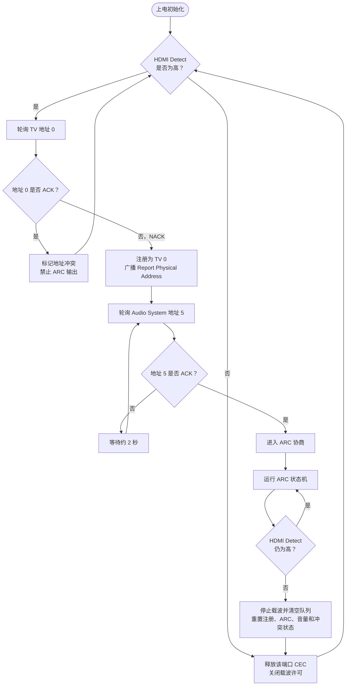
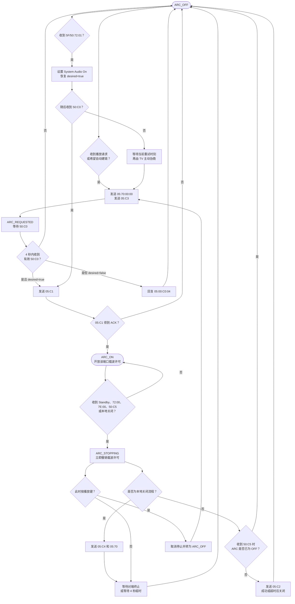
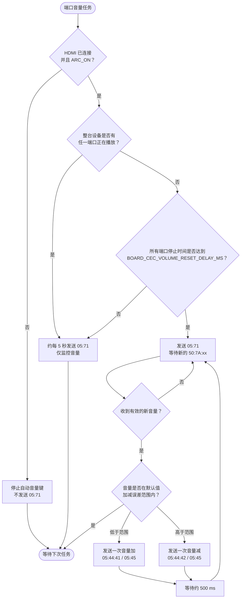

# CEC / ARC 处理逻辑

本文档描述当前固件作为 HDMI TV 侧设备时的 CEC、ARC、HDMI Detect、HPD 和
Soundbar 音量控制逻辑。实际行为以 `src/cec_arc.c`、`src/cec_tv.c` 和所选 `boards/*.h`
配置为准。

| 设备 | CEC 逻辑地址 | 物理地址 |
| --- | --- | --- |
| 本设备（TV） | `0` | `0.0.0.0` |
| Soundbar（Audio System） | `5` | 由 Soundbar 管理 |
| 广播地址 | `F` | — |

本设备模拟独立 TV，不应与另一台使用地址 `0` 的真实 TV 共用 CEC 总线。固件实现
ARC，不是 eARC，也不解码或重新编码音频数据。

## 1. 板级配置

引脚和可调参数来自 `boards/c1.h` 或 `boards/c2.h`：

| 配置项 | C1 | C2 | 说明 |
| --- | ---: | ---: | --- |
| `BOARD_ARC_COUNT` | 1 | 2 | ARC/CEC 端口数 |
| `BOARD_HPD` | GP18 | GP28 | 共用 HPD，低有效 |
| `BOARD_ARC1_CEC` | GP19 | GP24 | 端口 1 CEC |
| `BOARD_ARC1_DETECT` | GP17 | GP29 | 端口 1 HDMI 5V 检测，高有效 |
| `BOARD_ARC2_CEC` | — | GP22 | 端口 2 CEC |
| `BOARD_ARC2_DETECT` | — | GP19 | 端口 2 HDMI 5V 检测，高有效 |
| `BOARD_CEC_DEFAULT_VOLUME` | 20 | 20 | 默认目标音量 |
| `BOARD_CEC_VOLUME_TOLERANCE` | 2 | 2 | 默认音量误差 |
| `BOARD_CEC_VOLUME_RESET_DELAY_MS` | 30000 | 30000 | 全设备停止播放后的等待时间 |

CEC GPIO 为开漏方式：固件只主动拉低，发送高电平时切换为输入释放总线，且不启用
内部上拉。必须使用外部 CEC 接口、上拉和电平保护，不能将 Pico GPIO 直接接到
HDMI 5V 信号。

## 2. 端口和总线维护

每个端口独立维护 CEC 收发、地址注册、Soundbar 存在状态、ARC 状态机、8 帧发送
队列、音量键、默认音量复位和音频链路许可。C2 两路的协商和消息队列互不干扰。

CEC 位级状态机由 50 us 定时器驱动；帧解析、发送队列和业务状态机在主循环的
`cec_arc_task()` 中处理。普通帧发送失败最多尝试 3 次。地址轮询帧不做帧级重发，
而由状态机安排下一次轮询。

HPD 为所有端口共用：任一路 HDMI Detect 为高时拉低 HPD；所有端口均断开时释放
HPD。

### 2.1 CEC 操作总流程

下面流程对每个 ARC 端口独立执行；C2 会分别运行两套相同的端口状态机。



### 2.2 ARC 建链、断开和重新激活流程



图中的 `05:00:C0:04` 只会在收到 `50:C0` 时 ARC 仍不允许开启的情况下发送。
Soundbar 先发送 `5F:72:01` 或 `50:72:01` 会恢复 `desired=true`，因此随后发送
`50:C0` 时，TV 会进入 `05:C1` 分支并重新连接 ARC。

### 2.3 音量监控和默认音量复位流程



任一端口重新开始播放时，全局停止计时和所有端口的自动调整都会立即取消。只有仍然
连接且处于 `ARC_ON` 的端口会参与默认音量复位。

## 3. 连接、拔线和地址注册

上电后每个端口默认希望开启 ARC，但只有该端口 HDMI 5V 存在且完成 CEC/ARC 协商
后，才允许输出载波。

初始化约 1 秒后轮询 TV 地址 `0`：

- 得到 ACK：已有 TV 占用地址 `0`，设置地址冲突并停止该端口注册和 ARC 输出；
- 得到 NACK：注册为 TV 地址 `0`，广播 `0F:84:00:00:00`；
- 总线错误：约 2 秒后重试。

注册后轮询 Audio System 地址 `5`。得到 ACK 后标记 Soundbar 存在并开始 ARC 协商；
未检测到时约每 2 秒重新轮询。

当某端口 HDMI Detect 从高变低时，立即：

- 停止该端口载波并关闭 ARC 指示；
- 清空发送队列和重试计数，重置位级收发器；
- 清除地址注册、冲突、Soundbar 存在、System Audio、ARC、音量键和复位状态；
- 将 CEC GPIO 切回输入释放状态。

重新插入后会从地址注册开始重新协商，不会沿用拔线前收到的 Terminate ARC、
System Audio Mode Off 或其他 CEC 状态。

## 4. ARC 状态机

| 数值 | 状态 | 含义 |
| ---: | --- | --- |
| 0 | `CEC_ARC_OFF` | ARC 关闭 |
| 1 | `CEC_ARC_REQUESTED` | 等待 Soundbar 的 `50:C0` |
| 2 | `CEC_ARC_REPORTING` | 正在发送 `05:C1` |
| 3 | `CEC_ARC_ON` | ARC 已建立 |
| 4 | `CEC_ARC_STOPPING` | 正在终止 ARC |

### 4.1 开启

正常握手：

1. TV 发送 `05:70:00:00`：System Audio Mode Request，地址 `0.0.0.0`。
2. TV 发送 `05:C3`：Request ARC Initiation。
3. Soundbar 回复 `50:C0`：Initiate ARC。
4. TV 发送 `05:C1`：Report ARC Initiated。
5. `05:C1` 得到 ACK 后进入 `ARC_ON`。

请求和报告阶段超时均为 4 秒；失败后回到 `OFF`，通常约 5 秒后再尝试。Soundbar
对 `C3` 或 `C1` 返回 Feature Abort 时，固件关闭 ARC 并取消自动重启，直到再次按
播放键。

### 4.2 播放键重新选择输入

ARC 未连接或已关闭时按播放键，会设置 ARC 为期望开启，发送带物理地址的
`05:70:00:00` 并重新协商。若当时处于 `STOPPING`，先转为 `OFF`，不会继续关闭。

ARC 已经为 `ON` 时不重复握手，而是广播：

- `0F:86:00:00`：Set Stream Path；
- `0F:82:00:00`：Active Source，TV。

这用于 Soundbar 被切换到其他本地输入后重新选择 TV/ARC。因此在 `STOPPING` 时按
播放，后续发送的是 `05:70:00:00`，不是关闭 System Audio 使用的 `05:70`。

### 4.3 关闭

本地请求关闭时立即撤销载波许可并进入 `STOPPING`，随后发送：

- `05:C4`：Request ARC Termination；
- `05:70`：System Audio Mode Request Off（无物理地址参数）。

收到 `50:C5`（Terminate ARC）时：

- ARC 尚未关闭：进入 `STOPPING`，取消开启期望，并回复 `05:C2`；
- ARC 已经为 `OFF`：保持关闭，不再重复发送 `05:C2`。

后一规则避免 Soundbar 广播 `5F:72:00` 后又发送 `50:C5` 时，TV 在 ARC 已断开的
情况下重复回复 `05:C2`。`STOPPING` 最长等待 4 秒；`05:C2` 发送完成或超时后进入
`OFF`。

## 5. 主要接收消息

| 收到的消息 | 名称 | 当前处理 |
| --- | --- | --- |
| `50:C0` | Initiate ARC | 期望开启时回复 `05:C1`，否则 Feature Abort/Refused |
| `50:C5` | Terminate ARC | 未关闭时回复 `05:C2`；已经关闭时不回复 `C2` |
| `5F:72:00`、`50:72:00` | Set System Audio Mode Off | 记录 Off，并开始关闭 ARC |
| `5F:72:01`、`50:72:01` | Set System Audio Mode On | 记录 On，恢复 ARC 开启意图，允许随后由 `50:C0` 激活 ARC |
| `50:7E:00/01` | System Audio Mode Status | 更新状态；Off 时关闭 ARC |
| `50:7A:xx` | Report Audio Status | 更新静音位和 0–100 音量 |
| `50:8F` | Give Device Power Status | 回复 `05:90:00`，报告 On |
| `50:83` | Give Physical Address | 广播 `0F:84:00:00:00` |
| `50:46` | Give OSD Name | 回复 `05:47` 和 `Pico ARC TV` |
| `50:9F` | Get CEC Version | 回复 `05:9E:05`，即 CEC 1.4 |
| `5F:36` 或定向 Standby | Standby | 请求关闭 ARC |

ARC 操作码 `C0`–`C5` 只接受来自地址 `5`、定向发给地址 `0` 且没有多余参数的消息。
不属于 Soundbar → TV 方向的 `C1/C3/C4` 会回复 Feature Abort/Refused。

不支持的定向操作码会收到 Feature Abort/Unsupported Opcode；参数数量或数值错误会收到
Invalid Operand。Feature Abort 本身不会再次触发 Feature Abort。

`05:00:C0:xx` 表示 TV 地址 `0` 向 Soundbar 地址 `5` 发送 Feature Abort：`C0` 是被
拒绝的操作码，`xx` 是原因。缺少原因字节的 `05:00:C0` 不是完整的标准 Feature
Abort 帧。

## 6. 音量按键、监控和默认音量复位

手动音量使用 User Control：

- 音量加按下：`05:44:41`；
- 音量减按下：`05:44:42`；
- 释放：`05:45`；
- 持续按住时约每 300 ms 重发按下消息。

它只改变 Soundbar 音量，不修改音频数据。C2 音量键只发给当前选择的 ARC 端口。

固件仅在对应端口同时满足 HDMI Detect 为高和 `ARC_ON` 时发送 `05:71`（Give Audio
Status）。ARC 未连接、协商中、停止中或 HDMI 已拔出时不会持续询问音量。正常监控
间隔为 5 秒。

默认音量复位按“整台设备”计时，而不是某个被切走端口单独计时：

1. 任一端口还在播放时，不执行复位；
2. 所有端口停止播放后，等待 `BOARD_CEC_VOLUME_RESET_DELAY_MS`；
3. 到时后，所有仍连接且为 `ARC_ON` 的端口才开始调整；
4. 每次先发送 `05:71`，仅使用新收到的 `50:7A:xx` 判断；
5. 低于允许范围时模拟一次音量加，高于范围时模拟一次音量减；
6. 按键后约 500 ms 再查询，逐级调整至允许范围；
7. 任一端口重新播放时，立即停止所有自动调整。

允许范围为默认音量加减误差，并限制在 0–100。默认值为 20、误差为 2，因此
18–22 均满足要求。静音位会被记录，但当前复位逻辑不主动取消静音。

## 7. 音频载波许可

端口只有同时满足以下条件才允许输出载波：

```text
HDMI Detect 为高
AND TV 地址已注册
AND 无地址冲突
AND ARC 状态为 ARC_ON
AND ARC 仍为期望开启
```

CEC/HPD/DDC 链路维护独立于播放器状态。播放器停止或端口被切走时，ARC 可以保持，
SPDIF 层可发送静音/无效音频载荷以防 Soundbar 自动待机；但 HDMI 拔线、ARC 关闭或
地址冲突会立即撤销载波许可。

## 8. 诊断和排查

| 变量 | 含义 |
| --- | --- |
| `cec_rx_frames` | 所有端口成功接收帧数 |
| `cec_tx_frames` | 所有端口成功发送帧数 |
| `cec_tx_errors` | 所有端口发送失败数 |
| `cec_rx_errors` | 所有端口接收错误和丢帧之和 |
| `cec_arc_state` | 端口 1 ARC 状态，数值见第 4 节 |
| `cec_address_conflict` | 端口 1 是否存在 TV 地址冲突 |

为兼容旧调试流程，后两个变量只反映端口 1；帧和错误计数为全部端口汇总。

无音频输出时依次检查 HDMI Detect、HPD、地址冲突、地址 `5` 是否响应、是否出现
`05:C3 → 50:C0 → 05:C1`、`05:C1` 是否获得 ACK，以及 CEC 外部电路和相应端口
SPDIF/ARC 输出路径。

## 9. 功能边界与验证

- 支持基础 ARC、System Audio、音量键、音频状态、电源状态、物理地址、OSD 名称和
  CEC 版本响应；
- 不支持 eARC、完整 HDMI TV 功能或厂商私有命令；
- 电源状态始终报告 On，因为关闭 ARC 不等于 Pico 断电；
- CEC 握手成功不能单独保证某种 Soundbar 或 Atmos 格式兼容；
- DDC/EDID 及完整板卡接线见 `RP_ZERO_C2.md` 和 `PROGRAM_LOGIC.md`。

CEC 由 `PICODAC_CEC` 控制，默认开启；启用时编译 `src/cec_wire.c`、
`src/cec_tv.c` 和 `src/cec_arc.c`。构建应复用现有 C1/C2 构建目录及缓存的 Pico
工具链，不新建目录或重复
下载依赖。回归测试入口为：

```powershell
python tests/run_tests.py
```

主机测试可覆盖状态机和消息处理；真实 CEC 电气波形、Soundbar 兼容性以及 CEC、
DDC、双路音频同时工作的稳定性仍需实机验证。
